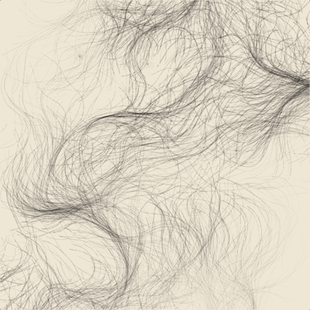

# Creative Coding Lab · 用代码复活东方美学



> 每一期，用几百行代码把一件**文物 / 一种传统美学**变成可以拨动、会呼吸的交互作品。
> 灵感来自 [Chinese-PhoenixCrown（凤冠字帘）](https://github.com/aigc17/Chinese-PhoenixCrown)，但走一条自己的路：**p5.js 为主力，关键高光上 shader。**

这是一个 creative coding 自媒体的**内容仓库**——不是一个库，而是一档"节目"。每期是 `episodes/` 下的一个文件夹，一个能直接在浏览器打开的作品 + 一份原理拆解。

---

## 🎬 内容公式

这个频道的每一期都套同一个可复制的公式：

> **传统文化母题（文物 / 书画 / 纹样）× 生成算法 × 可交互 × 一条 15–75 秒演示视频**

- **母题**给国潮审美的钩子（"这居然是代码画的？"）
- **算法**给技术惊叹（流场、粒子、物理、shader）
- **交互**给传播理由（观众想自己上手拨一下）
- **短视频**给流量入口（前 3 秒必须出成品）

## 🧰 技术栈

| 用途 | 选择 | 理由 |
| --- | --- | --- |
| 主力创作 & 教学 | **p5.js** | 上手快、社区大、几十行出效果，适合边做边教 |
| 高光炸场镜头 | **GLSL shader**（p5 `createShader` / glsl-canvas） | 光影、流体、辉光这类"贵"效果 |
| 作品级发布 | vanilla Canvas 2D / three.js | 需要极致丝滑与性能时（凤冠走的这条路） |
| 录屏出片 | 浏览器录屏 / `saveGif` / ffmpeg | 竖屏 3 秒钩子 + 横屏完整版 |

新手建议：**先把 p5.js 吃透**（本仓库所有 demo 都能跑通、能改参数），再按需碰 shader。

## 📁 仓库结构

```
creative-coding-lab/
├── README.md              # 你在看的这份
├── CONTENT_PLAN.md        # 20 期选题库 + 各平台发布策略  ← 先看这个
├── template/              # 每期的可复用 p5.js 模板（种子/参数面板/导出）
│   ├── index.html
│   ├── sketch.js
│   └── README.md
└── episodes/
    └── 01-ink-flow-field/ # 第一期：水墨流场「墨林 Ink Forest」
        ├── index.html     # 双击即可在浏览器打开，可交互
        ├── PHILOSOPHY.md   # 这期的算法哲学
        └── README.md       # 拆解 + 出片脚本
```

## ▶️ 怎么跑

任何一期都是纯前端，**双击 `index.html` 就能在浏览器打开**。要本地起服务器（避免个别浏览器的跨域限制）：

```bash
cd episodes/01-ink-flow-field
python3 -m http.server 8000
# 浏览器打开 http://localhost:8000
```

同一颗**种子（seed）永远画出同一幅画**——方便你复现某张满意的构图，也方便观众"抄作业"。

## 🗺️ 剧集索引

| # | 标题 | 母题 | 技术点 | 状态 |
| --- | --- | --- | --- | --- |
| 01 | 墨林 Ink Forest | 水墨 / 飞白 | Perlin 流场 + 叠墨 | ✅ 可跑 |
| 02 | 饕餮 Taotie | 青铜纹样 | 对称递归 + 网格 | 📝 待做 |
| 03 | 飞天 Apsaras | 敦煌飘带 | 参数曲线 + 缎带 | 📝 待做 |
| … | | | | 见 `CONTENT_PLAN.md` |

## 🤝 如何加新的一期

1. 复制 `template/` 到 `episodes/NN-你的标题/`
2. 在 `sketch.js` 里写你的算法（模板已备好种子、参数面板、导出）
3. 写一份 `PHILOSOPHY.md`（这期在表达什么）+ `README.md`（出片脚本）
4. 更新上面的剧集索引

## 📜 License

代码 MIT（见 `LICENSE`）。生成的作品图归你所有，随便发。
