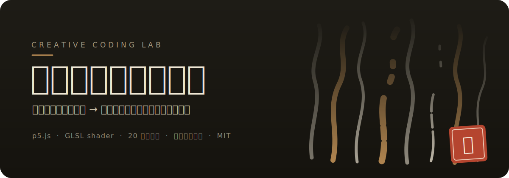
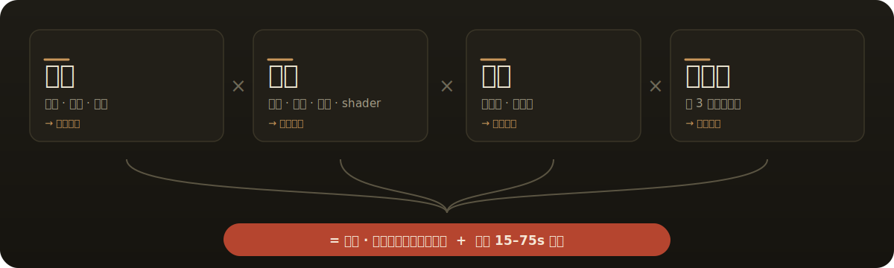

<p align="center">
  
</p>

<p align="center">
  <b>▶ <a href="https://shuaimxu.github.io/creative-coding-lab/episodes/01-ink-flow-field/">第 01 期 · 静态版</a></b>
  &nbsp;·&nbsp; <b><a href="https://shuaimxu.github.io/creative-coding-lab/episodes/01-ink-flow-field/narrative.html">叙事版 · 墨成诗</a></b>
  &nbsp;·&nbsp; <a href="CONTENT_PLAN.md">20 期选题库</a>
  &nbsp;·&nbsp; <a href="LICENSE">MIT</a>
</p>

---

## 先看成品 · 墨林 Ink Forest

<p align="center">
  
</p>

<p align="center"><sub>第 01 期 · <code>seed=1024</code> · 上千道墨迹沿同一张噪声场流淌，浓处成山、淡处成雾、断处成飞白</sub></p>

**这不是一张图片——是代码画的，而且可以拨动。** 打开在线 demo，拖动毛笔注墨、调种子和参数，同一颗种子永远画出同一幅画：

```bash
# 任何一期都是纯前端，双击 index.html 就能在浏览器打开
cd episodes/01-ink-flow-field
python3 -m http.server 8000   # 或直接双击 index.html
# → http://localhost:8000
```

> **这是一个 creative coding 自媒体的内容仓库——不是一个库，而是一档「节目」。**
> 每期是 `episodes/` 下的一个文件夹：一个能直接在浏览器打开的可交互作品 + 一份原理拆解。
> 灵感来自 [Chinese-PhoenixCrown（凤冠字帘）](https://github.com/aigc17/Chinese-PhoenixCrown)，但走一条自己的路：**p5.js 为主力，关键高光上 shader。**

<br>

<p align="center">
  
</p>

每一期都套同一个可复制的引擎，四个要素缺一不可：

<p align="center">
  
</p>

- **母题**给国潮审美的钩子——「这居然是代码画的？」
- **算法**给技术惊叹——流场、粒子、物理、shader
- **交互**给传播理由——观众想自己上手拨一下
- **短视频**给流量入口——前 3 秒必须出成品

> 各平台的「一次创作，三种剪法」发布策略，见 [CONTENT_PLAN.md](CONTENT_PLAN.md)。

<br>

<p align="center">
  
</p>

| 用途 | 选择 | 理由 |
| --- | --- | --- |
| 主力创作 & 教学 | **p5.js** | 上手快、社区大、几十行出效果，适合边做边教 |
| 高光炸场镜头 | **GLSL shader**（p5 `createShader` / glsl-canvas） | 光影、流体、辉光这类「贵」效果 |
| 作品级发布 | vanilla Canvas 2D / three.js | 需要极致丝滑与性能时（凤冠走的这条路） |
| 录屏出片 | 浏览器录屏 / `saveGif` / ffmpeg | 竖屏 3 秒钩子 + 横屏完整版 |

> 新手路线：**先把 p5.js 吃透**（本仓库所有 demo 都能跑通、能改参数），再按需碰 shader。

<br>

<p align="center">
  
</p>

| # | 标题 | 母题 | 技术点 | 状态 |
| :---: | --- | --- | --- | :---: |
| 01 | [墨林 Ink Forest](episodes/01-ink-flow-field/) | 水墨 / 飞白 | Perlin 流场 + 叠墨 | ✅ [静态](https://shuaimxu.github.io/creative-coding-lab/episodes/01-ink-flow-field/) · [叙事](https://shuaimxu.github.io/creative-coding-lab/episodes/01-ink-flow-field/narrative.html) |
| 02 | 饕餮 Taotie | 青铜纹样 | 对称递归 + 网格 | 📝 待做 |
| 03 | 飞天 Apsaras | 敦煌飘带 | 参数曲线 + 缎带 | 📝 待做 |
| … | | | | 完整 20 期见 [CONTENT_PLAN.md](CONTENT_PLAN.md) |

同一颗**种子（seed）永远画出同一幅画**——方便你复现某张满意的构图，也方便观众照着 seed「抄作业」。这是生成艺术的「版号」。

<br>

<p align="center">
  
</p>

```
creative-coding-lab/
├── CONTENT_PLAN.md        # 20 期选题库 + 各平台发布策略  ← 先看这个
├── template/              # 每期的可复用 p5.js 模板（种子 / 参数面板 / 导出）
└── episodes/
    └── 01-ink-flow-field/ # 第 01 期：水墨流场「墨林 Ink Forest」
        ├── index.html     #   双击即可在浏览器打开，可交互
        ├── PHILOSOPHY.md  #   这期的算法哲学
        └── README.md      #   拆解 + 出片脚本
```

加新的一期，四步：

1. 复制 `template/` 到 `episodes/NN-你的标题/`
2. 在 `sketch.js` 里写你的算法（模板已备好种子、参数面板、导出）
3. 写一份 `PHILOSOPHY.md`（这期在表达什么）+ `README.md`（出片脚本）
4. 更新上面的剧集索引

## License

代码 MIT（见 [LICENSE](LICENSE)）。生成的作品图归你所有，随便发。
